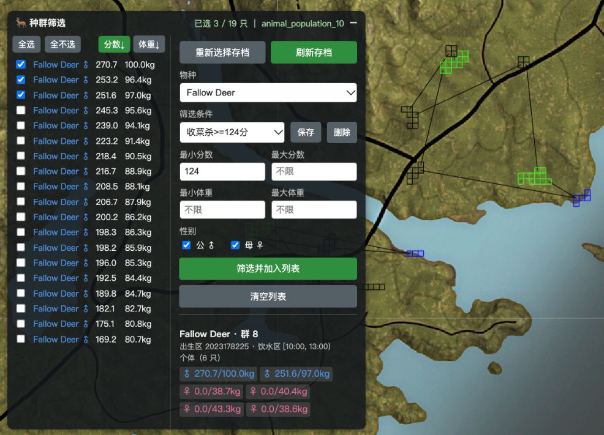

# DECA COTW 地图增强油猴脚本

这是一个为 [DECA theHunter: COTW 地图](https://mathartbang.com/deca/hp/map.html) 提供的养猎辅助工具。  
它结合存档中的个体分数，按物种、分数、体重和性别筛选兽群，帮助你快速定位地图上存在目标个体的点位。

## 使用场景

养猎时，我们通常需要持续击杀中等分数的个体。
例如，养黄鹿时，前期通常需要保留 2 级和 5 级的雄性、击杀 3–4 级雄性

这个脚本在原有系统的基础上，增加可以按分数、体重和性别筛选兽群、查看群内个体分数；
可以找出**至少有一只个体**分数命中范围的兽群，并勾选这些兽群。
点击地图区域后，也能查看该位置命中的兽群及其个体分数，方便你在地图上逐点查看和安排狩猎。

选择一次存档文件后，游戏将更新写入该文件时，点击“刷新存档”即可重新解析；无需每轮狩猎后手动重新选择或导入存档。

## 核心功能

| 功能           | 说明                                                            |
| -------------- | --------------------------------------------------------------- |
| 单文件存档刷新 | 选择一个 `animal_population_*` 文件，点击“刷新存档”时重新解析。 |
| 分数区间筛选   | 按物种和目标分数范围勾选包含命中个体的兽群。                    |
| 体重筛选       | 按体重范围勾选包含命中个体的兽群。                              |
| 性别筛选       | 可只看公或只看母。                                              |
| 条件预设       | 保存常用筛选条件，点击可快速切换。                              |
| 兽群个体分数   | 在种群树中查看兽群内个体分数。                                  |
| 个体性别体重   | 在种群树中查看兽群内个体的性别和体重。                          |
| 已选个体列表   | 筛选命中的个体追加到浮窗左侧列表，可逐只取消、排序、全选。      |
| 地图区域分数   | 点击地图区域，查看命中兽群及其个体分数。                        |

## 安装

1. 在浏览器中安装 Tampermonkey，也就是油猴脚本。
2. 在 Tampermonkey 中新建脚本，将 `cotw-population-filter.user.js` 的全部内容粘贴进去并保存。
3. 打开或刷新 [DECA theHunter: COTW 地图](https://mathartbang.com/deca/hp/map.html)。
4. 按地图原有方式导入存档。完成后，页面右上角会出现“种群筛选”面板。

## 使用方法

1. 点击“选择存档文件”选择一个 `animal_population_*` 文件；之后点击“刷新存档”手动更新，或点击“重新选择存档”切换文件。
2. 在“物种”下拉框中选择要处理的物种。
3. 输入最小分数和/或最大分数。分数边界**包含在范围内**；留空表示该方向不限制。
4. 输入最小体重和/或最大体重。体重边界**包含在范围内**；留空表示该方向不限制。
5. 用“公 / 母”两个复选框选择性别；两个都勾或都不勾都表示不限性别。
6. 点击“筛选并加入列表”。同时满足分数、体重和性别条件的个体所在兽群会被勾选，这些个体追加到左侧列表；已经在勾选状态的不受影响，也不会取消任何已有勾选。
7. 在左侧“已选个体”列表里逐只取消或勾选，会同步种群树上的兽群勾选；列表默认按分数降序，可切换成按体重排序，顶部可全选或全不选。刷新存档后列表会清空。
8. 条件设好后点“筛选条件”旁的“保存”，命名后即可存成预设；之后在该下拉框里选择即可套用。
9. 在地图上查看已勾选兽群对应的位置。需要查看某个兽群的个体性别、分数和体重时，展开种群树中该兽群旁的箭头。
10. 点击地图上的种群区域后，浮窗底部会列出该点击位置命中的兽群、出生区、区域类型和时间段，以及群内个体分数。
11. 点击“清空列表”可以清空左侧列表，并取消种群树中的所有勾选，不限于当前选择的物种。
12. 页面重新打开后会恢复已选文件；如需授权，点击“刷新存档”并按浏览器提示操作。
13. 面板标题栏可以拖动；单击标题栏可折叠或展开面板。

## 使用提醒

本脚本用于辅助查看和筛选地图上的兽群，不会修改存档，也不会自动执行狩猎操作。
分数筛选结果可帮助你缩小目标范围，最终仍请结合游戏内实际情况判断。
